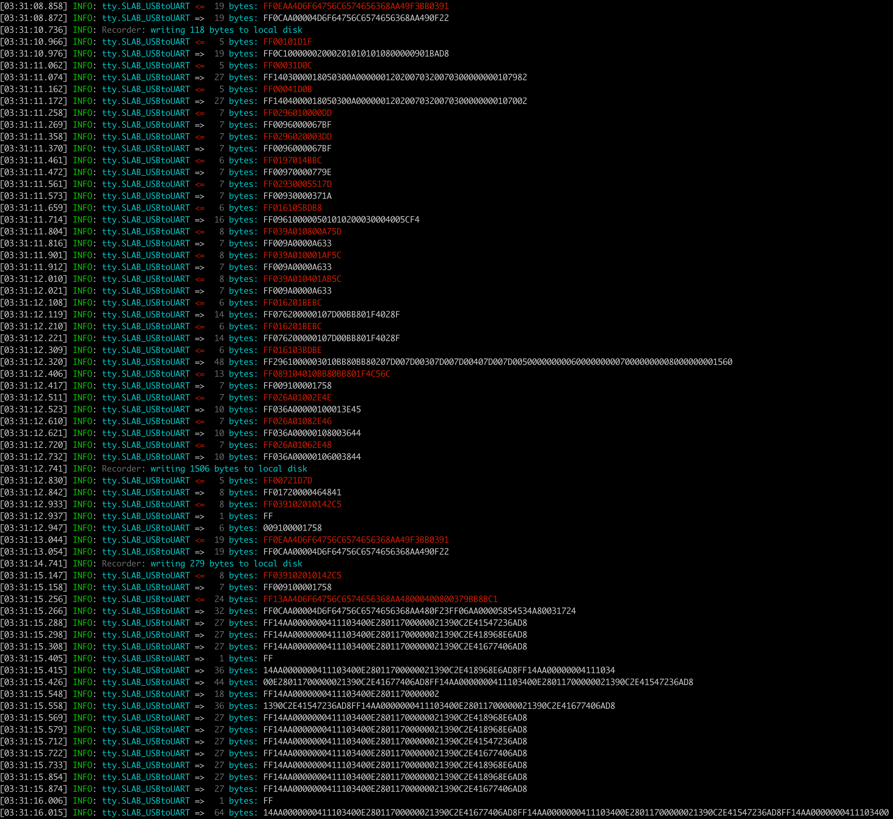
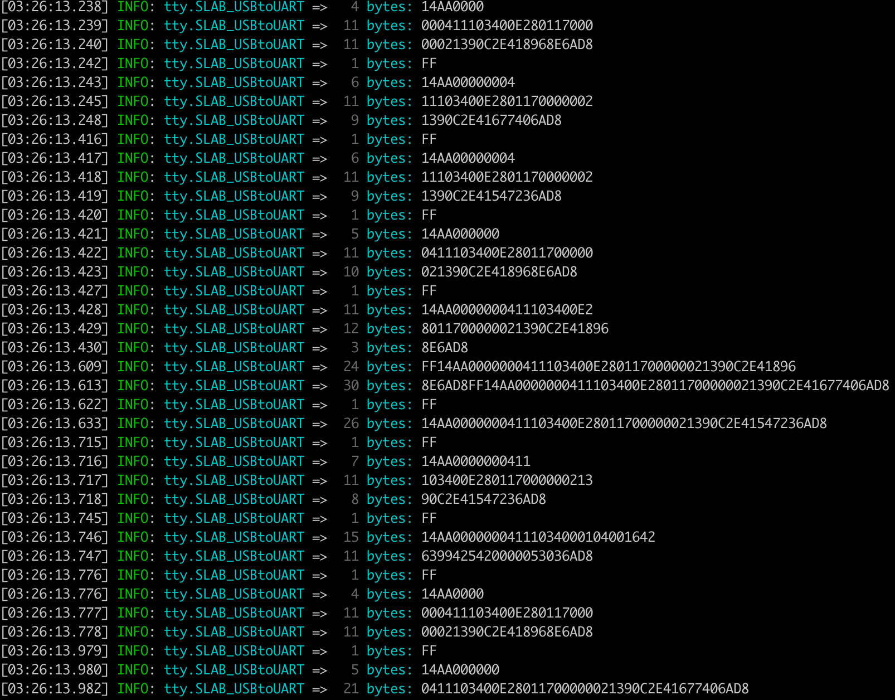

<!-- START doctoc generated TOC please keep comment here to allow auto update -->
<!-- DON'T EDIT THIS SECTION, INSTEAD RE-RUN doctoc TO UPDATE -->
**Table of Contents**  *generated with [DocToc](https://github.com/thlorenz/doctoc)*

- [serial-tcp-proxy](#serial-tcp-proxy)
  - [Prerequisites](#prerequisites)
  - [Startup](#startup)
    - [Example1 (line)](#example1-line)
    - [Example2 (raw)](#example2-raw)
    - [Example3 (raw + queued)](#example3-raw--queued)
    - [Example4 (raw + recording)](#example4-raw--recording)

<!-- END doctoc generated TOC please keep comment here to allow auto update -->

# serial-tcp-proxy

TCP Proxy on specific serial port.


(Raw mode with 10ms as queued interval)


## Prerequisites

For the users installed `serial-tcp-proxy` before v0.5.0, please perform following steps to upgrade carefully, because the logging library `pino` was upgraded to v7 with breaking changes:

1. `git pull`
2. `rm -rf node_modules`
3. `npm install`


## Startup

Run the proxy server with following arguments:

```text
stp start <filepath> [<assetDir>]

startup a tcp proxy server on the serial port with specified path

Options:
      --version   Show version number                                  [boolean]
      --help      Show help                                            [boolean]
  -p, --port      the port number for tcp proxy server to listen
                                                      [required] [default: 8080]
                                                      
  -b, --baud      baud rate for opening serial port   [required] [default: 9600]
  
  -d, --databits  data bits                              [required] [default: 8]
  
  -y, --parity    parity                            [required] [default: "none"]
  
  -s, --stopbits  stop bits                              [required] [default: 1]
  
  -v, --verbose   verbose output           [boolean] [required] [default: false]
  
  -r, --raw       raw mode, no byline parsing
                                           [boolean] [required] [default: false]
                                           
  -q, --queued    buffered data for X milliseconds before emitting, only for raw
                  mode. 0 indicates to disable this feature, and mimimal value
                  for X is 5ms                           [required] [default: 0]
                  
  -c, --capture   enable catprue mode to record serial transmission data, might
                  be none, serial, tcp, or both                [default: "none"]

Examples:
  stp start /dev/tty.usbmodem1462103  run tcp proxy server at default port 8080,
                                      and relay the traffic of serial port at
                                      path /dev/tty.usbmodem1462103

Not enough non-option arguments: got 0, need at least 1
```

### Example1 (line)

Run the proxy server to listen to tcp port 3000, and communicate with serial port `/dev/tty.usbmodem1462103` with default baudrate 9600:

```text
./index.js start -p 3000 /dev/tty.usbmodem1462103
```

### Example2 (raw)

Run the proxy server to listen to default tcp port 8080, and communicate with serial port `/dev/tty.SLAB_USBtoUART` with specified baudrate 115200, and treat it as RAW mode (instead of LINE mode by default), no queued data:

```text
./index.js start -r -b 115200 /dev/tty.SLAB_USBtoUART
```



All received data (from either serial or tcp) are emitted immediately without any delay. Above picture shows more than 1 byte are coming even within 1 millisecond.


### Example3 (raw + queued)

Run the proxy server to listen to default tcp port 8080, and communicate with serial port `/dev/tty.SLAB_USBtoUART` with specified baudrate 115200, and treat it as RAW mode (instead of LINE mode by default), queued data with 10ms timer interval:

```text
./index.js start -r -q 10 -b 115200 /dev/tty.SLAB_USBtoUART
```


All received data from either serial or tcp are queued in a buffer for 10ms and then emitted entire buffer once.


### Example4 (raw + recording)

Run the proxy server to listen to default tcp port 8080, and communicate with serial port `/dev/tty.SLAB_USBtoUART` with specified baudrate 115200 in RAW mode, and capture both tcp/serial data in `/tmp` directory with TSV format

```text
./index.js start -r -c both -b 115200 /dev/tty.SLAB_USBtoUART
```

The captured data are stored in `/tmp/serial-tcp-proxy-[epoch].tsv`, for example `/tmp/serial-tcp-proxy-1647631866732.tsv`. And the format of the captured data looks like following text:

```text
# start: Sat Mar 19 2022 04:04:30 GMT+0800 (Taipei Standard Time)

! 0000000000.132 => 009200D800FF00FF
! 0000000000.180 => FF
! 0000000000.181 => 14AA0000000411
! 0000000000.182 => 103400E28011700000021390
! 0000000000.184 => C2E418968E6AD8
! 0000000000.187 => FF14AA0000000411103400E28011700000021390C2E41677406AD8
! 0000000000.213 => FF
! 0000000000.214 => 14AA0000000411103400E280
! 0000000000.215 => 11700000021390C2E41896
! 0000000000.216 => 8E6AD8
! 0000000000.222 => FF
! 0000000000.222 => 14AA000000041110
! 0000000000.223 => 3400E28011700000021390
! 0000000000.224 => C2E41547236AD8
! 0000000000.226 => FF
! 0000000000.227 => 14AA0000000411
! 0000000000.228 => 103400E280117000000213
! 0000000000.229 => 90C2E41677406AD8
! 0000000000.335 => FF14AA00
! 0000000000.336 => 00000411103400E2801170
! 0000000000.338 => 0000021390C2E41677406AD8
! 0000000000.343 => FF

...

! 0000000000.899 => FF
! 0000000000.901 => 14AA0000000411103400E2801170000002
! 0000000000.902 => 1390C2E41677406AD8
! 0000000000.909 => FF
! 0000000000.910 => 14AA0000000411103400E280
! 0000000000.910 => 11700000021390C2E4154723
! 0000000000.911 => 6AD8
! 0000000000.939 => FF
! 0000000000.941 => 14AA0000000411103400E28011700000021390C2E418968E
! 0000000000.942 => 6AD8
! 0000000001.047 => FF
! 0000000001.047 => 14AA0000000411103400E2
! 0000000001.048 => 8011700000021390C2E415
! 0000000001.049 => 47236AD8
! 0000000001.053 => FF
! 0000000001.053 => 14AA0000000411
! 0000000001.054 => 103400010300164263992002
! 0000000001.055 => 400000EE286AD8
! 0000000001.076 => FF

...
```

It's a SPACE-separatd format, with 4 columns:

- `prefix`, the single character to indicate the type of packet in current line
  - `!`, streaming data packet
  - `#`, comment packet
- `uptime`, the uptime since the recording was started. Please note the milliseconds are separted by dot `.`
- `direction`, the data direction
  - `=>`, the data from serial port (to tcp connections)
  - `<=`, the dtaa to serial port (from tcp connections)
- `hexes`, the data buffer represented in hexadecimal format
